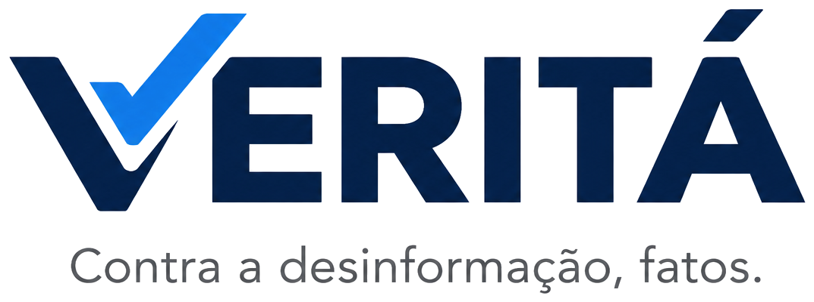

<div align="center">



<br>

**Diretório de fontes de notícias confiáveis, com pesquisa e filtros, feito só com HTML, CSS e JavaScript.**


[Sobre](#-sobre-o-projeto) •
[Funcionalidades](#-funcionalidades) •
[Como executar](#-como-executar) •
[Adicionando fontes](#-como-adicionar-fontes) •
[Pesquisa](#-contexto-da-pesquisa) •
[Equipe](#-equipe)

</div>

---

## 📌 Sobre o projeto

**Veritá – Contra a desinformação, fatos.** é um site que reúne em um só lugar fontes de notícias confiáveis (jornais, agências, checagem de fatos, divulgação científica e órgãos públicos) e permite encontrá-las rapidamente por **pesquisa** e **filtros**.

O projeto nasceu da pesquisa sobre o tema:

> **Eleições 2026, desinformação e ataques com vídeos de IA: como saber o que é verdade.**

A ideia central é simples: em um período em que conteúdos falsos circulam com facilidade, o eleitor precisa saber **onde ir** para conferir uma informação. O Veritá organiza esses caminhos.

### Objetivos

- Facilitar o acesso a **fontes confiáveis** e oficiais.
- Incentivar o **pensamento crítico** e a conferência de informações antes de compartilhar.
- Contribuir para a **inclusão digital**, com uma página leve, acessível e sem necessidade de cadastro.

---

## ✨ Funcionalidades

| Recurso | Descrição |
| --- | --- |
| 🔎 **Pesquisa em tempo real** | Busca por nome, descrição, tipo, país, idioma e categoria. Ignora acentos e maiúsculas (`agencia` encontra `Agência`). |
| 🏷️ **Filtros combináveis** | Categoria, tipo de fonte, país e idioma, com contador de resultados por opção. |
| ↕️ **Ordenação** | Por nome (A–Z ou Z–A) e por categoria. |
| 🖼️ **Logo de cada fonte** | Campo opcional; se faltar, o cartão mostra a inicial do nome. |
| 🌗 **Modo escuro automático** | Segue a preferência do sistema do visitante. |
| 📱 **Responsivo** | Layout adaptado para celular, com filtros recolhíveis. |
| ♿ **Acessível** | Foco visível, rótulos para leitores de tela e respeito a "reduzir movimento". |
| 🔐 **Segurança no front-end** | Textos inseridos com `textContent` e links externos com `rel="noopener noreferrer"`. |
| 🧱 **Sem backend** | Não há servidor, banco de dados nem cadastro: basta abrir o `index.html`. |

### Como a busca e os filtros funcionam

- Dentro de um **mesmo grupo** de filtro vale o **"ou"**. Exemplo: *Categoria = Ciência* **ou** *Tecnologia*.
- Entre **grupos diferentes** vale o **"e"**. Exemplo: *Categoria = Ciência* **e** *Idioma = Português*.
- A pesquisa por texto exige que **todas as palavras** digitadas apareçam na fonte.

---

## 🚀 Como executar

Não é preciso instalar nada.

**Opção 1 — direto no navegador**

1. Baixe ou clone o projeto.
2. Abra o arquivo `index.html` com um duplo clique.

**Opção 2 — servidor local (recomendado durante o desenvolvimento)**

```bash
# dentro da pasta do projeto
python3 -m http.server 8000
```

Depois acesse `http://localhost:8000`.

> 💡 A página carrega as fontes tipográficas do Google Fonts. Sem internet, ela usa a fonte padrão do sistema e continua funcionando normalmente.

---

## 🗂️ Estrutura de pastas

```text
site-fontes/
├── index.html            # estrutura da página
├── README.md             # esta documentação
├── assets/
│   ├── logo-verita.png   # logo do projeto
│   ├── favicon.png       # ícone da aba do navegador
│   └── fontes/           # logos das fontes de notícias (opcional)
├── css/
│   └── style.css         # estilos, cores e modo escuro
└── js/
    ├── fontes.js         # ⭐ lista de fontes — o único arquivo que a equipe edita
    └── app.js            # busca, filtros, ordenação e criação dos cartões
```

---

## ➕ Como adicionar fontes

Toda a lista fica em **`js/fontes.js`**. Para incluir uma fonte, copie um bloco `{ ... }` dentro do array `FONTES` e preencha os campos. Lembre da vírgula entre os blocos.

```js
{
  nome: "Piauí",
  url: "https://piaui.folha.uol.com.br",
  logo: "assets/fontes/piaui.png",          // opcional
  descricao: "Reportagens longas e análises sobre política e cultura.",
  categoria: ["Política", "Cultura"],
  tipo: "Jornal",
  pais: "Brasil",
  idioma: "Português"
},
```

### Campos

| Campo | Obrigatório | Formato | Exemplo |
| --- | :---: | --- | --- |
| `nome` | ✅ | texto | `"Agência Lupa"` |
| `url` | ✅ | texto, começando com `https://` | `"https://lupa.news"` |
| `descricao` | ✅ | uma frase curta | `"Checagem de fatos..."` |
| `categoria` | ✅ | **lista** de textos | `["Checagem", "Política"]` |
| `tipo` | ✅ | texto | `"Agência"` |
| `pais` | ✅ | texto | `"Brasil"` |
| `idioma` | ✅ | texto | `"Português"` |
| `logo` | ➖ | caminho da imagem | `"assets/fontes/lupa.png"` |

### Novas categorias, países e idiomas

Não é preciso alterar o HTML nem o JavaScript: basta escrever o novo valor em uma fonte. Ele aparece sozinho nos filtros, já com o contador.

### Cuidados

- **Escreva sempre do mesmo jeito.** `Política` e `Politica` viram duas categorias diferentes.
- **`categoria` é sempre uma lista**, mesmo com um só item: `["Geral"]`.
- **Confira cada URL** antes de publicar.
- **Logos:** salve em `assets/fontes/` e verifique se o uso da marca é permitido.

---

## 🧰 Tecnologias

- **HTML5**: estrutura semântica.
- **CSS3**: variáveis, Grid, Flexbox e `prefers-color-scheme`.
- **JavaScript (ES6+)**: sem frameworks nem bibliotecas.
- **Google Fonts**: *Bricolage Grotesque* e *Public Sans*.

---

## 🗳️ Contexto da pesquisa

O conteúdo abaixo resume a pesquisa que motivou o projeto.

### 🌐 Inclusão digital

A inclusão digital aproxima a população do processo democrático. Em Rondônia, iniciativas como os **Fóruns Digitais** mostram como a tecnologia supera barreiras geográficas e facilita o acesso aos serviços e às instituições eleitorais, principalmente em regiões mais afastadas. Eles auxiliam na conferência das urnas, no recebimento de mídias e na transmissão de dados, reduzindo deslocamentos e dando mais agilidade e transparência ao processo.

Ao mesmo tempo, o ambiente digital traz desafios: as redes sociais ampliaram a participação cidadã, mas também facilitaram a circulação de **desinformação**. Por isso, o acesso à tecnologia precisa vir acompanhado de **educação digital, pensamento crítico e acesso a informações confiáveis**.

### 🛡️ Segurança do sistema eleitoral

- **Testes e auditorias:** o TSE realiza verificações para confirmar o funcionamento da urna e a correspondência entre os votos registrados e os resultados. O **Teste de Integridade** compara votos previamente registrados com o resultado produzido pela urna, e partidos e entidades fiscalizadoras podem acompanhar.
- **Proteção da infraestrutura de TI:** a Justiça Eleitoral conta com monitoramento, gestão de vulnerabilidades, firewalls, SIEM, backup e proteção de redes, além de estruturas para responder a incidentes.
- **Ataques cibernéticos:** entre os riscos estão ataques que comprometem a disponibilidade dos serviços, como **DDoS**. O TSE trabalha com mapas de riscos e planos de contingência.
- **Transparência e fiscalização:** a segurança não depende só de mecanismos técnicos. O processo tem etapas acompanháveis por partidos, entidades e sociedade, como a emissão do **Boletim de Urna (BU)** no encerramento da votação.
- **Combate à desinformação:** proteger o eleitor contra informações falsas também faz parte da segurança eleitoral.

### 📡 Infraestrutura digital

A democracia depende da infraestrutura digital, e não apenas da segurança das urnas. Portais oficiais, sistemas de apuração, veículos de imprensa e serviços online são essenciais para que o eleitor acesse informações confiáveis.

- Ataques **DDoS** podem tirar esses serviços do ar e aumentar a sensação de instabilidade institucional.
- Com os sistemas indisponíveis, o cidadão não consegue **verificar a informação na fonte oficial**, o que favorece a desinformação.
- O problema é maior para quem já enfrenta dificuldades de acesso, usabilidade ou letramento digital, podendo gerar **exclusão**.
- Os ataques podem servir de **"cortina de fumaça"**: enquanto as equipes recuperam os sistemas, outras ações de desinformação ganham espaço.
- A proteção deve abranger órgãos públicos, mídia, provedores de internet e serviços de DNS.

### 🖥️ Desenvolvimento tecnológico

O Brasil começou a informatizar o processo eleitoral antes mesmo da urna eletrônica, utilizada pela primeira vez em **1996**. Desde então, a tecnologia evoluiu com biometria, criptografia, assinaturas digitais, auditorias e recursos de acessibilidade.

| ✅ Ponto positivo | ⚠️ Ponto negativo |
| --- | --- |
| **Maior rapidez e segurança.** A urna reduziu o tempo de apuração e os problemas da contagem manual, com várias camadas de segurança e auditoria. | **Dependência tecnológica e necessidade de confiança.** O processo exige investimento constante em segurança, atualização e auditoria, e a falta de conhecimento da população sobre o funcionamento do sistema pode gerar desconfiança. |

### 🔗 Relação com o Veritá

Quando portais ficam fora do ar ou circulam boatos e vídeos manipulados, o eleitor precisa de **caminhos confiáveis e fáceis de encontrar** para conferir os fatos. O Veritá reúne esses caminhos em uma página leve, sem cadastro e sem dependência de servidor.

---

## 👥 Equipe

| Integrante |
| --- |
| Pedro Henrique de Oliveira Milhomens |
| Weverton Henrique Cordeiro |
| Pedro Kaiki Gasparini |
| Danilo Chaves |
| José Rian Pablo |
| Matheus Mereles |
| Matheus Barbosa Gaspar |
| Jaina Klitzke |
| Pedro Henrique Rodrigues de Souza |

---

## 📚 Fontes da pesquisa

- [SGC — notícia 412544](https://sgc.com.br/noticia/5/412544)
- [Portal Amazônia — Democracia digital e fortalecimento das instituições democráticas são temas de painel em Rondônia](https://portalamazonia.com/fram/democracia-digital-e-fortalecimento-das-instituicoes-democraticas-sao-temas-de-painel-em-rondonia/)
- [TSE — TSE destaca segurança e transparência do sistema eleitoral a representantes diplomáticos (agosto de 2026)](https://www.tse.jus.br/comunicacao/noticias/2026/Agosto/tse-destaca-seguranca-e-transparencia-do-sistema-eleitoral-a-representantes-diplomaticos)
- [Material sobre infraestrutura digital e ataques DDoS](https://share.google/gZINUDxY8Yz2MTwoA)
- [Tribunal Superior Eleitoral (TSE)](http://tse.jus.br/)

---

## 🔭 Próximos passos (ideias)

- [ ] Guardar a busca e os filtros na URL, para compartilhar uma pesquisa por link.
- [ ] Marcar fontes como favoritas no navegador.
- [ ] Criar uma seção explicando **como a equipe avalia** cada fonte.
- [ ] Incluir um guia rápido para identificar vídeos e imagens gerados por IA.

---

## ⚠️ Aviso

A lista é **curada manualmente**. Uma fonte estar no Veritá não garante que todo o conteúdo publicado por ela esteja correto. Confira sempre mais de uma fonte antes de compartilhar uma informação.

## 📄 Licença

Licença a ser definida pela equipe.

<div align="center">

**Veritá – Contra a desinformação, fatos.**

</div>